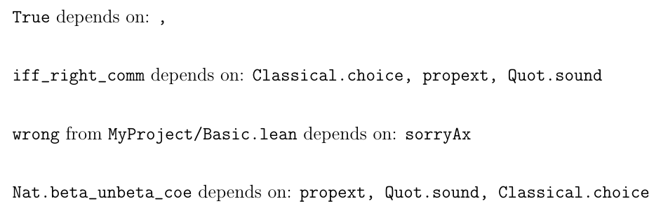

RepLeanTeX
==========

This is a proof of concept to run the
[`Lean 4 repl`](https://github.com/leanprover-community/repl)
*while* compiling a LaTeX document.
The main goal is to avoid repeated calls to `lake env lean`,
and only start the `repl` once for each LaTeX compilation.

Currently the only feature is an `\axioms{...}` command to
print the dependencies of its argument:

```latex
\verb|True| depends on: \axioms{True}

\verb|iff_right_comm| depends on: \axioms{iff_right_comm}

\verb|wrong| from \texttt{MyProject/Basic.lean} depends on: \axioms{wrong}

\verb|Nat.beta_unbeta_coe| depends on: \axioms{Nat.beta_unbeta_coe}
```



Quick start
-----------

Make sure that you set the same Lean version with `elan default`.
Currently it is not enough to set it locally.

```bash
git clone https://github.com/m4lvin/RepLeanTeX.git
cd RepLeanTex
make setup # or adjust the version of repl and myProject manually
make
```
